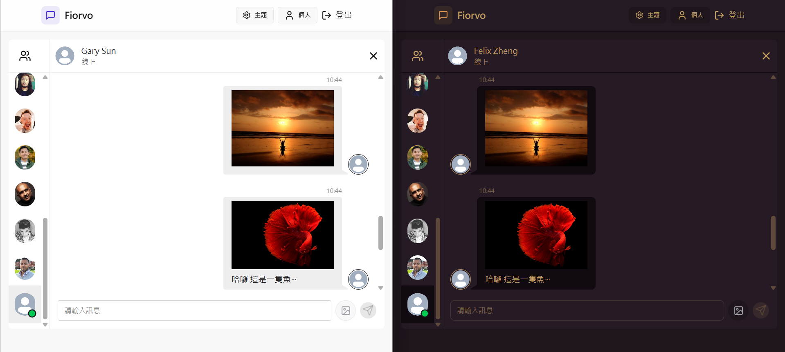
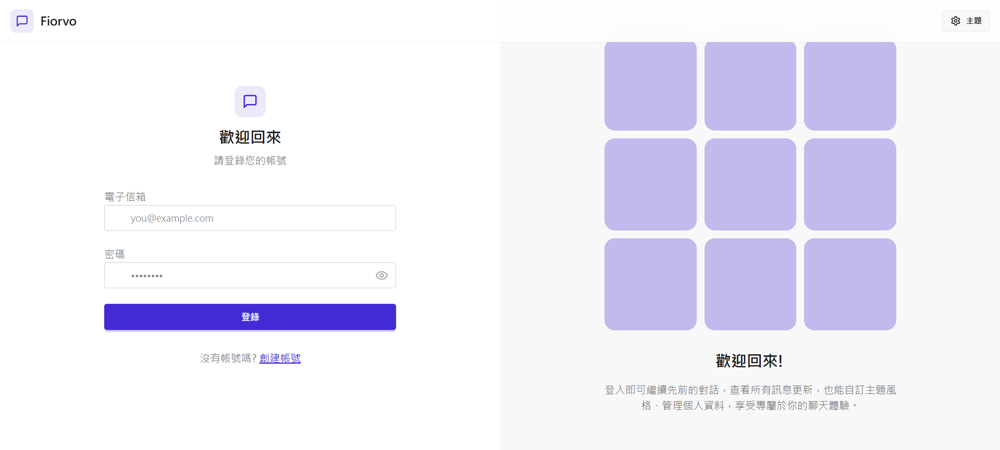
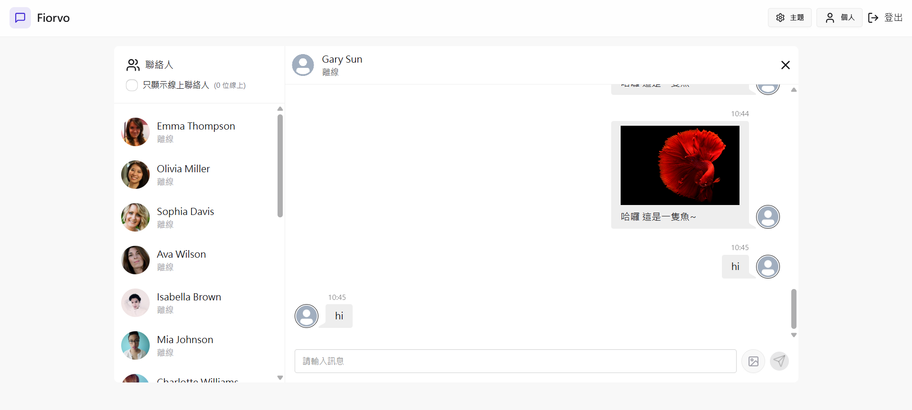
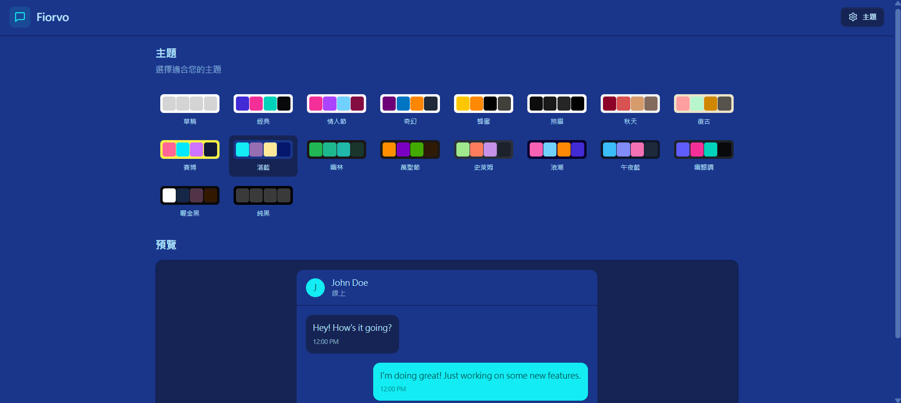
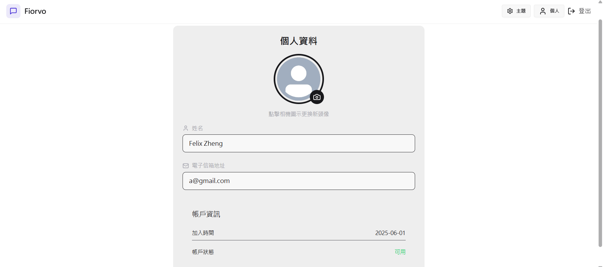

# 🛍️ Fiorvo — MERN 專案即時聊天系統

Fiorvo Chatting 是一個使用 MERN Stack 打造的簡易聊天室系統，支援雙方用戶即時收發訊息，搭配 Socket.IO 技術實作即時推播。此專案著重於學習狀態管理（Zustand）與即時通訊核心邏輯。

**作者** : Felix Zheng




---

## 🚀 Tech Stack

- **前端**：React + Tailwind CSS + Vite + Zustand
- **後端**：Node.js + Express + Socket.io
- **資料庫**：MongoDB
- **資源儲存** : Cloudinary
- **部署**：Render


---

## Live Demo
**此專案部屬為免費方案，隔15分鐘再次訪問時會需要喚醒伺服器(大約30秒)**

> 👉 登入入口：[FIORVO](https://realtimechatapp-acaa.onrender.com/login)  

本應用為雙人即時聊天設計，若想體驗完整效果，請使用以下任一方式登入兩個用戶：
- 開啟兩個不同瀏覽器（如 Chrome 與 Edge）
- 第二個帳號使用無痕視窗開啟
---

## ✨ 功能列表 Features

### 前台（使用者端）
- 註冊與登入
- 雙方用戶即時收發訊息
- 訊息紀錄儲存於資料庫
- 響應式設計
- 多種顏色主題供用戶選擇

---

## 📷 網站畫面 Screenshots

### 登錄畫面 Login Page


### 聊天室畫面 Chatting Page


### 設定主題頁面 Setting Page


### 個人資料 Profile Page


---

建立專案
```bash
npm run build
```

啟動後端伺服器
```bash
cd backend
npm start
```

啟動本地前端
```bash
cd frontend
npm run dev
```


請於 `backend` 目錄下建立 `.env` 檔案，範例如下：

```env
PORT=5001
MONGODB_URI="mongodb+srv://<username>:<password>@cluster0.xxxxxx.mongodb.net"
CLOUDINARY_API_KEY="your_cloudinary_api_key"
CLOUDINARY_SECRET_KEY="your_cloudinary_secret"
CLOUDINARY_NAME="your_cloudinary_name"
JWT_SECRET="your_jwt_secret"
NODE_ENV=development
```

## 🗃️ MongoDB Atlas 資料庫設定

1. 前往 [MongoDB Atlas](https://www.mongodb.com/cloud/atlas) 註冊帳號。
2. 建立一個 Cluster 並新增一個 Database。
3. 建立一組 Database 使用者帳號與密碼。
4. 點選「Connect」>「Connect your application」，複製連線字串：
5. 將上方連線字串貼上至 `.env` 中的 `MONGODB_URI`，並替換 `<username>` 與 `<password>`。

---

## 🌩️ Cloudinary 圖片上傳設定

1. 前往 [Cloudinary](https://cloudinary.com/) 註冊帳號。
2. 登入後進入 Dashboard，可看到以下資訊：
- **Cloud name** → 對應 `.env` 裡的 `CLOUDINARY_NAME`
- **API Key** → 對應 `.env` 裡的 `CLOUDINARY_API_KEY`
- **API Secret** → 對應 `.env` 裡的 `CLOUDINARY_SECRET_KEY`
3. 將這些資訊複製並填入 `.env` 檔案中。

---

**參考資料** : [Codesistency](https://www.youtube.com/watch?v=ntKkVrQqBYY&list=PLbwZ-6yH1AZriV1s6nH2A63of99O9nGbg&index=2)  
